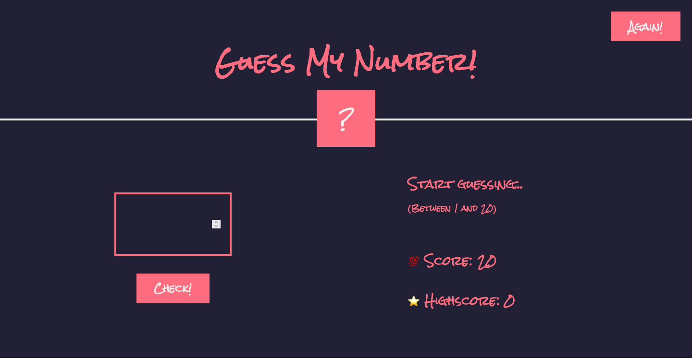

# Table of contents

- [Overview](#overview)
  - [Features](#features)
  - [Screenshot](#screenshot)
  - [Links](#links)
- [My process](#my-process)
  - [Built with](#built-with)

## Overview

### Features

Users should be able to:

- Play the game
- Restart the game
- Keep count of high score
- Keep count of current score

### Screenshot

### Links

- Live Site URL: [https://mw3981.github.io/guess-my-number/]

## My process

### Built with

- Semantic HTML5
- CSS
- Javascript

## Author

- Website - [Michelle Wong](https://michellewong.me/)
